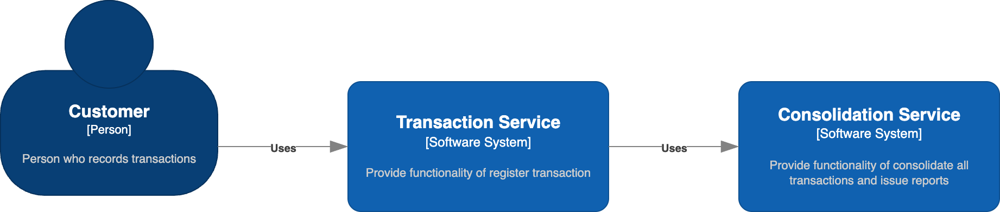

# System Modeling
System modeling is the process of developing abstract models of a system, with each model presenting a different view or perspective of that system, usually means representing a system using some kind of graphical notation. In this context I used C4 Model (C4) to represent the architecture and Unified Modeling Language (UML) to represent the design of the components.

## Context
The context diagrams are useful to show a high level view of the environment, including boundaries.
