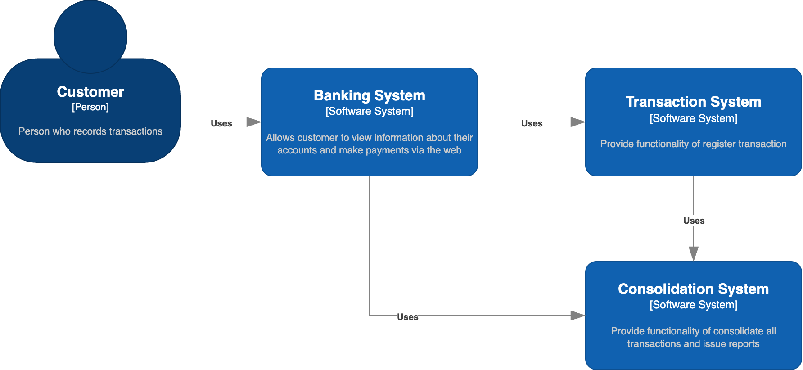
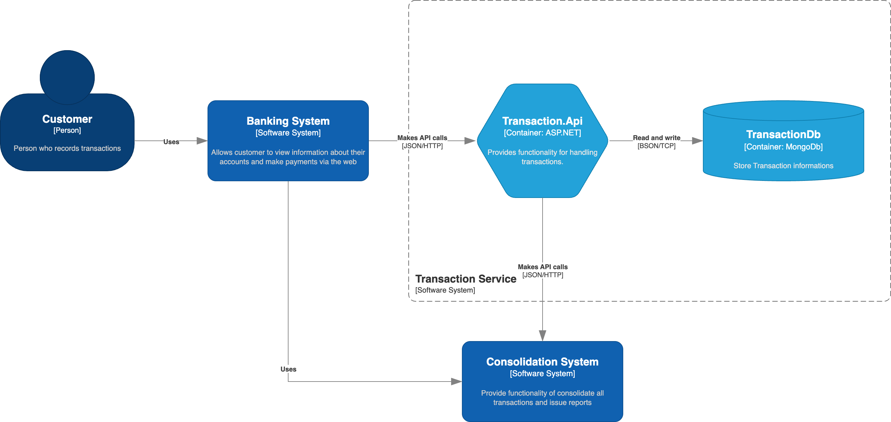
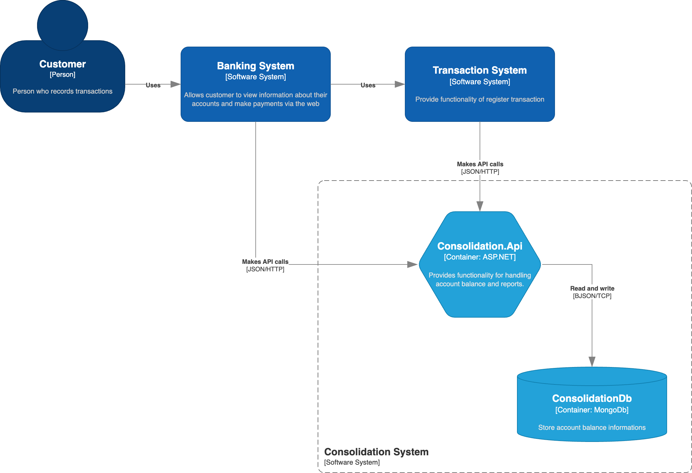

# System Modeling
System modeling is the process of developing abstract models of a system, with each model presenting a different view or perspective of that system, usually means representing a system using some kind of graphical notation. In this context I used C4 Model (C4) to represent the architecture and Unified Modeling Language (UML) to represent the design of the components.

## Context
The context diagrams are useful to show a high level view of the environment, including boundaries.

### Cash flow Context

## Container
A container diagram is essentially a runtime boundary around some code that is being executed or some data that is being stored.

### Container Transaction System

### Container Consolidation System

## References
- Sommerville, Ian. "Software engineering, Global ed." Always learning. Boston Munich: Pearson (2016).
- Mavrogiorgou, Argyro, et al. "C4 Model: a Research Guide for Designing Software Architectures." 2025 8th International Conference on Software and System Engineering (ICoSSE). IEEE, 2025.